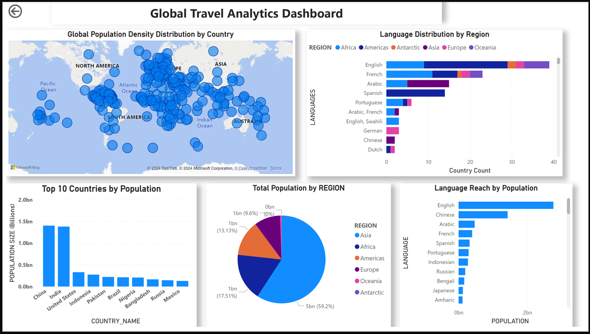

# TRAVEL-AGENCY-DATA-PLATFORM (CDE-CAPSTONE PROJECT): Data Platform for a Travel Agency

## Project Overview
This project focuses on building a **Data Platform** for a Travel Agency to process data from the [Country REST API](https://restcountries.com/v3.1/all) into a **cloud-based database/data warehouse**. The platform is tailored to empower the agency's Data Science team with the ability to perform **predictive analytics**, delivering actionable insights for recommending tourist locations based on diverse data points.

## Key Features
1. **ETL Workflow**
   - Extract raw data from the Country REST API.
   - Store raw data in **Parquet format** in an S3 Bucket.
   - Transform and load the required fields into Snowflake for downstream analytics.

2. **Orchestration**
   - The workflow is orchestrated using **Apache Airflow**, automating each step of the data pipeline.

3. **Data Modeling**
   - **dbt** is used to structure data into **Fact** and **Dimension** tables for easier querying.
   - **SQL** is used extensively in **dbt** for data transformations and modeling.

4. **Containerization**
   - The ETL pipeline is containerized using **Docker** for portability and scalability.

5. **Cloud Integration**
   - **S3 Bucket** is used for storing raw data.
   - **Snowflake** is the data warehouse for storing transformed data.

6. **CI/CD Implementation**
   - Continuous Integration (CI) ensures code linting to maintain best practices.
   - Continuous Deployment (CD) builds and pushes Docker images to a cloud-based container registry for deployment.

## Technologies Used

| **Technology**       | **Purpose**                                                                  |
|-----------------------|------------------------------------------------------------------------------|
| **Python**            | Programming language used for writing ETL scripts.                          |
| **SQL**               | Used in **dbt** for transforming and modeling the data in Snowflake.         |
| **Apache Airflow**    | Orchestrates the data pipeline, automating tasks.                           |
| **dbt**               | Models data into Fact and Dimension tables for analytics.                  |
| **S3 Bucket**         | Stores raw API data in Parquet format (Data Lake).                          |
| **Snowflake**         | Cloud-based data warehouse for structured data storage.                     |
| **Docker**            | Containerizes the ETL pipeline for portability and deployment.              |
| **Terraform**         | Provisions cloud resources (S3 bucket, IAM roles) using infrastructure-as-code. |
| **Power BI**          | Visualizes insights derived from data.                                      |

## How to Set Up the Project

1. **Clone the Repository**
   ```bash
   git clone https://github.com/Zainytee/TRAVEL-AGENCY-DATA-PLATFORM
   cd TRAVEL-AGENCY-DATA-PLATFORM

2. **Install Dependencies**
   ```python
   pip install -r requirements.txt
3. **Run Docker Container Build and run the Docker container for the ETL pipeline**
   ```docker
   docker build -t travel-agency-pipeline-image .
   docker run travel-agency-pipeline-image
4. **Apache Airflow Setup Initialize and start Airflow**
   ```bash
   airflow db init
   airflow webserver &
   airflow scheduler &
5. **DBT Setup Run dbt models**
   ```dbt
   dbt run
6. **Power BI Dashboard**

- Connect Power BI to Snowflake and create visualizations for insights.

## Data Architecture

The architecture integrates modern tools to streamline the ETL process:

Below is the **Data Architecture Diagram** that illustrates the end-to-end flow of the data pipeline:

.png)

1. **Extract**: 
   - Use **Apache Airflow** to fetch raw data from the **Country REST API** and store it in an **S3 bucket** in **Parquet format**.
   
2. **Transform**:
   - Use **Apache Airflow** to extract raw data from the **S3 bucket**, transform it, and load the data into **Snowflake**.
   - Further data modeling into **Fact** and **Dimension** tables is achieved using **dbt** and **SQL**.
   
3. **Load**:
   - The final, structured data is stored in **Snowflake** for querying and analysis.
   
4. **Visualize**:
   - Insights are derived using **Power BI**, which connects to **Snowflake**.

## Dashboard Insights

### Visualizations

Below is the **Power BI Dashboard** that visualizes insights derived from the data:



1. **Population Density Map**:
   - Identifies densely and sparsely populated regions globally.
   - Highlights opportunities for sustainable development and market expansion.

2. **Language Reach by Population**:
   - Shows the most widely spoken languages globally by population.
   - **English** emerges as the most globally influential language.

3. **Top 10 Countries by Population**:
   - Highlights the most populous nations, with **China** leading globally.

### Key Insights

1. The **population density map** reveals global distribution patterns, identifying urban hubs and sparsely populated areas.
2. **English** stands out as a globally influential language with widespread adoption.
3. **Asia** accounts for the largest population share at **59.2%**, as shown in the "Total Population by Region" chart.
4. The **"Top 10 Countries by Population"** highlights **China** as the world's most populous nation.

## Conclusion

This project demonstrates the implementation of a robust data platform leveraging modern data engineering practices. It showcases how cloud-based tools and orchestration frameworks can simplify complex workflows and deliver actionable insights for businesses.
